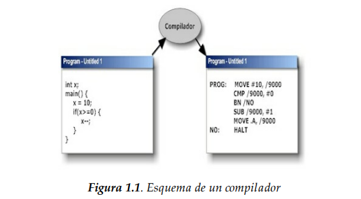
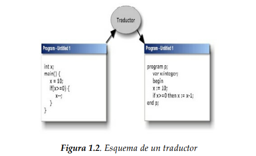
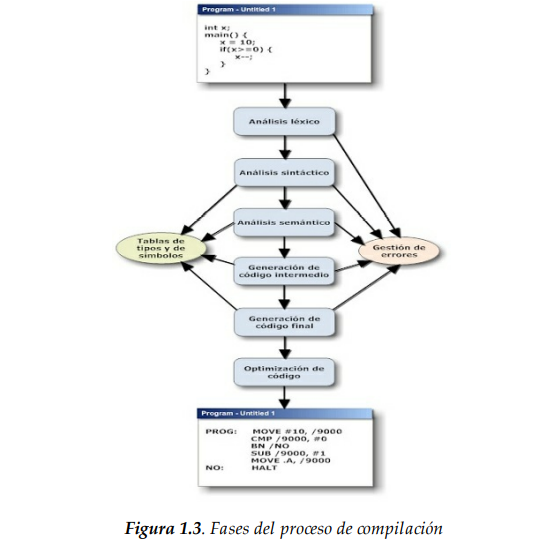
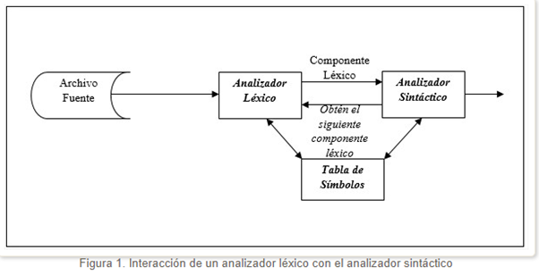
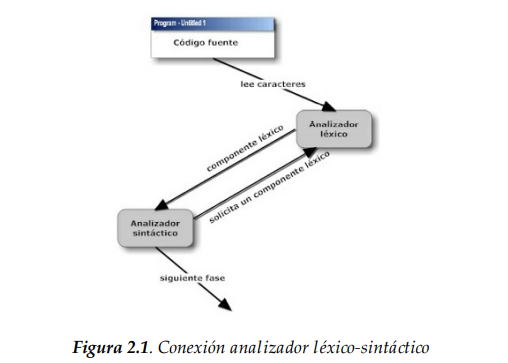
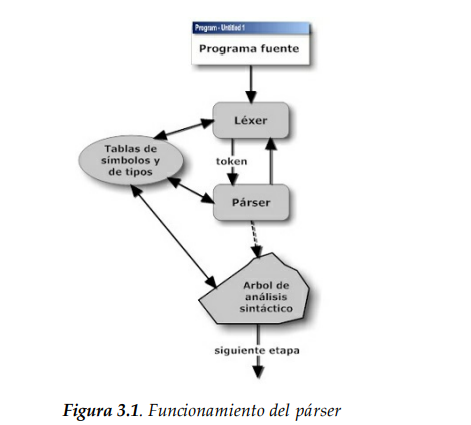

# COMPILADORES

## **Definición de compilador**
#### Un compilador es un tipo especial de traductor en el que el lenguaje fuente es un
#### lenguaje de alto nivel y el lenguaje objeto es de bajo nivel (figura 1.1). 
 
#

#### Un traductor es un programa que convierte el texto escrito en un lenguaje en texto
#### escrito en otro lenguaje (figura 1.2).
 

 

#### Un ensamblador es un compilador donde el lenguaje fuente es un lenguaje
#### ensamblador y el lenguaje objeto es el código de la máquina.
#### La diferencia entre compilador e intérprete es que el compilador analiza todo el programa fuente, crea el programa objeto y luego permite su ejecución (sólo del programa objeto obtenido) y el intérprete lee sentencia por sentencia el programa fuente, la convierte en código objeto y la ejecuta. Por lo tanto, es fácil comprender que tras  compilar un programa, su ejecución es mucho más rápida que la ejecución de un programa interpretado.
#
#### Uno de los motivos de la existencia de programas interpretados es que hay algunos lenguajes de programación que permiten añadir sentencias durante la ejecución, cosa que no se podría hacer si fueran compilados. Algunos ejemplos son las versiones más antiguas de Basic y actualmente el lenguaje Phyton.
#
#### El compilador es asistido por otros programas para realizar su tarea, por ejemplo, se utiliza un preprocesador para añadir ficheros, ejecutar macros, eliminar comentarios, etcétera.
# 
#### El enlazador se encarga de añadir al programa objeto obtenido, las partes de las librerías necesarias.
#### El depurador permite al programador ver paso a paso lo que ocurre durante la ejecución del programa. 
#### Hay compiladores que no generan código máquina sino un programa en ensamblador, por lo que habrá que utilizar un programa ensamblador para generar el código máquina.
# 
## **Estructura de un compilador**

#### Un compilador es un programa complejo que consta de una serie de pasos, generalmente entrelazados, y que como resultado convierte un programa en un lenguaje de alto nivel en otro de bajo nivel (generalmente código máquina o lenguaje ensamblador).
#
#### Los pasos o fases de la compilación están actualmente bien definidos y en cierta medida sistematizados, aunque no están faltos de dificultad. Esta aumenta conforme se incrementa la riqueza del lenguaje a compilar.
###### Las fases del proceso de compilación son las siguientes (figura 1.3):
 

## **Análisis Léxico**
### Marco Teórico

#### El Análisis Léxico es la primera fase de un compilador y consiste en un programa que recibe como entrada el código fuente de otro programa (secuencia de caracteres) y produce una salida compuesta de tokens (componentes léxicos) o símbolos. Estos tokens sirven para una posterior etapa del proceso de traducción, siendo la entrada para el Análisis Sintáctico.

#### La especificación de un lenguaje de programación a menudo incluye un conjunto de reglas que definen el léxico. Estas reglas consisten comúnmente en expresiones regulares que indican el conjunto de posibles secuencias de caracteres que definen un token o lexema.

#### En algunos lenguajes de programación es necesario establecer patrones para caracteres especiales (como el espacio en blanco) que la gramática pueda reconocer sin que constituya un token en sí.
# 
## **Función del Analizador Léxico**

#### Su principal función consiste en leer los caracteres de entrada y elaborar como salida una secuencia de componentes léxicos que utiliza el analizador sintáctico para hacer el análisis. En la figura 1 se puede apreciar el esquema de una interacción que se aplica convirtiendo el analizador léxico en una subrutina o corrutina del analizador sintáctico. Recibida la orden "obtener el siguiente componente léxico" del analizador sintáctico, el analizador léxico lee los caracteres de entrada hasta que pueda identificar el siguiente componente léxico.
#

 #

## **Análisis sintáctico**
#### El analizador léxico tiene como entrada el código fuente en forma de una sucesión de caracteres. El analizador sintáctico tiene como entrada los lexemas que le suministra el analizador léxico y su función es comprobar que están ordenados de forma correcta (dependiendo del lenguaje que queramos procesar). Los dos analizadores suelen trabajar unidos e incluso el léxico suele ser una subrutina del sintáctico. Al analizador sintáctico se le suele llamar párser. El párser genera de manera teórica un árbol sintáctico. Este árbol se puede ver como una estructura jerárquica que para su construcción utiliza reglas recursivas. La estructuración de este árbol hace posible diferenciar entre aplicar unos operadores antes de otros en la evaluación de expresiones. Es decir, si tenemos esta expresión en Java:

## **Análisis semántico**
#### Esta fase toma el árbol sintáctico teórico de la anterior fase y hace una serie de comprobaciones antes de obtener un árbol semántico teórico.
#### Esta fase es quizás la más compleja. Hay que revisar que los operadores trabajan sobre tipos compatibles, si los operadores obtienen como resultado elementos con tipos adecuados, si las llamadas a subprogramas tienen los parámetros adecuados tanto en número como en tipo, etc.
#### Esta fase debe preparar el terreno para atajar las fases de generación de código y debe lanzar los mensajes de error que encuentre. En resumen, su tarea es revisar el significado de lo que se va leyendo para ver si tiene sentido.
#### Esta fase, las anteriores y las siguientes se detallarán más adelante, en el desarrollo de los otros capítulos.

## **Generación de código intermedio**
#### El código intermedio (CI) es la representación en un lenguaje sencillo (incluso inventado por el creador del compilador) de la secuencia real de las operaciones que se harán como resultado de las fases anteriores.
#### Se trata de representar de una manera formalizada las operaciones a llevar a cabo en un lenguaje más cercano a la máquina final, aunque no a una máquina concreta sino a una máquina abstracta. Es decir, no consiste en generar código ensamblador para una máquina basada en un procesador M68000, por ejemplo, sino en generar código que podría luego implementarse en cualquier máquina. Este lenguaje intermedio debe de ser lo más sencillo posible y, a la vez, lo más parecido a la manera de funcionar de la máquina final 

## **Utilidad del análisis léxico**

#### Las técnicas que vamos a describir en este capítulo se utilizan tanto para laconstrucción de compiladores como para otras áreas no tan relacionadas con este campo de la informática. Por ejemplo, se utilizan para interpretar el código HTML de una página web, para interpretar un archivo de tipo .ini, etcétera.
#
#### El analizador léxico va leyendo del fichero de entrada los caracteres secuencialmente y los va agrupando, según las directivas programadas, en tokens con un significado conocido por el programador. Los tokens serán la entrada del analizador sintáctico.
#
#### Podríamos pensar que el papel del analizador léxico podría ser asumido por el analizador sintáctico, pero el diferenciar estas dos tareas hace posible aplicar técnicas específicas para cada una de ellas.
#
#### El analizador léxico hace las funciones, a la vez, de preprocesador ya que se encarga de eliminar los caracteres innecesarios para el proceso de compilación. Por ejemplo, elimina los espacios en blanco que hay entre palabra y palabra (siempre que no sean necesarios, como por ejemplo dentro de las cadenas de texto).
#
#### Una ventaja importante es que permite obtener estructuras similares aun cuando los caracteres de entrada no lo sean. Por ejemplo, debe ser equivalente “6+2/4” a “6 +2 / 4”. En ambos casos, el analizador léxico suministra al sintáctico los tokens 6, +, 2, / y 4.
#### Resumiendo, las funciones del analizador léxico son:
#### Agrupar caracteres según categorías establecidas por la especificación dellenguaje fuente.
#### Rechazar texto con caracteres ilegales o agrupados según un criterio no especificado.
#
## **Funcionamiento**
#
#### La relación entre el analizador léxico y el sintáctico es una relación de maestro esclavo. El sintáctico demanda al léxico que lea el siguiente lexema y el léxico lee los caracteres necesarios del fichero de entrada hasta que consigue completar un lexema, que será entregado a su maestro (el analizador sintáctico). Esta relación viene representada en la figura 2.1.
#
#### El funcionamiento del analizador léxico es:
- Construir tokens válidos a partir de la lectura carácter a carácter del fichero de entrada.
- Pasar tokens válidos al analizador sintáctico.
- Gestionar el manejo del fichero de entrada.
- Ignorar los espacios en blanco, comentarios y demás caracteres o tokens innecesarios para el proceso de análisis.
- Avisar de los errores encontrados en esta fase.
- Llevar la cuenta del número de línea para incluirlo en el aviso de error (esto es imprescindible para que el usuario pueda encontrar y corregir el error).
- Hacer las funciones de preprocesador. 
 

#

## **ANÁLISIS SINTÁCTICO**

## Funciones del analizador sintáctico
#### La función principal del analizador sintáctico (AS o párser) es comprobar que los tokens que le suministra el analizador léxico (AL o léxer) van ordenados según la especificación de la gramática del lenguaje a compilar. Y si no es así, dar los mensajes de error adecuados, pero continuar funcionando sin detenerse, hasta que se llegue al final del fichero de entrada. Es esencial que el proceso de análisis no se detenga al primer error encontrado, ya que así podrá informar al usuario en un solo informe de todos los errores generados.
#
#### Aparte de esta función principal, el párser es la unidad que guía todo el proceso, o casi todo, de la compilación. Esto es así porque por un lado va solicitando al léxer los tokens y al mismo tiempo va dirigiendo el proceso de análisis semántico y generación de código intermedio. Por lo que muchas veces se le llama al proceso de análisis semántico y generación de código intermedio, traducción dirigida por la sintaxis
 

# 
#### Generalmente, los analizadores sintácticos obtienen un árbol teórico que permite expresar el orden de los lexemas según van apareciendo. Ese árbol debe ser el modelo de donde salga el análisis semántico. Pero lo normal es que si utilizamos el método de la traducción dirigida por la sintaxis no lleguemos ni siquiera a plantearnos la generación del árbol ya que el párser realizará las acciones semánticas e incorporará los métodos para realizar la generación de código intermedio y avisará de errores y su recuperación.
#
#### Es decir, el analizador léxico hará las funciones de las dos siguientes etapas (analizador semántico y generación de código intermedio).

#### Pero si damos la oportunidad a la creación del árbol de análisis sintáctico, recorriéndolo es posible crear una representación intermedia del programa fuente, ya sea en forma de árbol sintáctico abstracto o en forma de programa en un lenguaje intermedio.
#
#### Para generar párser, podemos utilizar dos técnicas, o bien lo hacemos a mano (es difícil aunque eficiente en su funcionamiento) o mediante herramientas que lo generan automáticamente (es menos eficiente pero más fácil de implementar).
##
#### Para que un AS funcione, debemos especificar el lenguaje que debe poder leer.
#### Para especificar este lenguaje, debemos representarlo con unas reglas únicas y bien formadas de manera que el párser funcione de una manera bien definida. Es decir, el lenguaje debe ser formal (tener unas reglas bien definidas). A estas reglas se le llama gramática. Por lo tanto, el primer paso para poder implementar un AS es definir la gramática que debe ser capaz de analizar. 
#
## **Análisis sintáctico lineal**
#### Hay varios algoritmos de análisis sintáctico (incluso para gramáticas ambiguas), pero su coste computacional es elevado (del orden de n3). Por lo que debemos modificar un poco nuestra gramática (si es necesario) para que podamos utilizar un algoritmo de menor coste computacional (de coste lineal). Si conseguimos eliminar la ambigüedad, podremos utilizar dos estrategias:
#### **Análisis descendente:** partimos de la raíz del árbol de análisis sintáctico y vamos aplicando reglas por la izquierda para obtener una derivación por la izquierda del símbolo inicial. Para saber la regla a aplicar, vamos leyendo tokens de la entrada. De esta manera, construimos el árbol de análisis sintáctico. Recorriendo el árbol en profundidad, de izquierda a derecha, tendremos en las hojas los tokens ordenados.
#### **Análisis ascendente:** partimos de la cadena de entrada y vamos construyendo el árbol a partir de las hojas para llegar a la raíz. Si recorremos el árbol generado como en el caso anterior, encontraríamos los tokens ordenados.
#

## **ANÁLISIS SINTÁCTICO DESCENDENTE**
## **Introducción**
#### El análisis sintáctico descendente (ASD) consiste en ir haciendo derivaciones a la izquierda, partiendo del axioma inicial, hasta obtener la secuencia de derivaciones que reconoce a la sentencia. En realidad, se trata de aplicar un método de búsqueda en un árbol. El método es de búsqueda en profundidad.
#
#### Tal y como se dijo en el capítulo anterior, se va construyendo un árbol sintáctico en el que la raíz es el axioma inicial y los nodos son todas las derivaciones posibles para poder procesar una determinada sentencia. Pero podemos construir un árbol universal que englobe todas las posibles sentencias del lenguaje (o más bien de la gramática).
#
#### El método de ASD intenta encontrar en el árbol universal la sentencia a reconocer en cada momento. Pero es posible que esta búsqueda en profundidad se haga interminable porque haya ramas infinitas. Para evitar este inconveniente, se debe establecer un criterio para terminar la búsqueda por esa rama y establecerla por otra.
#

## **Analizadores sintácticos predictivos**

#
#### Hemos visto que los analizadores sintácticos con retroceso son ineficientes. Pero hay maneras de aumentar la eficiencia. Una de ellas es siendo capaces  de saber qué regla aplicar del conjunto de reglas aplicables en cada caso. Es decir, si tenemos un token y una serie de reglas a aplicar, debemos poder elegir una de ellas mirando si el primer token coincide con el que tenemos seleccionado.
#
#### Por ejemplo, en el ejemplo del epígrafe anterior, debíamos probar con cada una de las reglas 5, 6 y 7 para el no terminal F, pero si pudiéramos saber que el token actual es num, directamente aplicaríamos la regla 6 ya que las otras no podrían ser válidas. Si tuviéramos una gramática en que en cada caso supiéramos con exactitud qué regla aplicar sabiendo sólo el primer token de la regla, podríamos utilizar un nuevo tipo de analizador sintáctico descendente, el analizador sintáctico descendente predictivo (ASDP).
#
#### A las gramáticas que cumplen estos requisitos, se les llama LL(1). Aunque su número es reducido, hay técnicas para convertir gramáticas que no sean LL(1) en LL(1). Los ASDP son mucho menos costosos computacionalmente hablando que los ASD, por lo que se utilizan a la hora de implementar compiladores.
#
#### Para implementar un ASDP, se utiliza el concepto de conjunto de predicción. Se trata de relacionar cada regla de la gramática con todos los posibles terminales a que se puede acceder aplicando dicha regla.
#

## **Analizadores sintácticos descendentes recursivos**
## **(ASDR)**
#
#### Son un tipo especial de ASDP y por tanto sólo pueden analizar gramáticas LL(1).
#### Se trata de implementar tantas funciones recursivas como no terminales de la gramática.
#### Para cada no terminal se crea una función recursiva.
#### En la sección 3.5 vimos cómo construir un analizador sintáctico con diagramas de sintaxis. A partir de estos diagramas de sintaxis, y conociendo el siguiente token a analizar, es posible implementar un analizador sintáctico. En concreto, se trata de un analizador sintáctico descendente recursivo.
#### Para poder implementar un ASDR, es necesario que el lenguaje de
implementación admita la recursión. 
#### El proceso a seguir es crear los diagramas de sintaxis conforme a la gramática y a partir de ellos, realizar la implementación en el lenguaje elegido. 
#
## ** Implementación de ASDP’s**
#
#### Hemos visto en la sección anterior, que si conocemos el siguiente token a analizar, podemos construir un analizador sintáctico predictivo mediante diagramas de sintaxis y un lenguaje que admita la recursión. Pero hay otra manera de construir este tipo de analizadores: se trata de implementarlos a partir de una tabla.
#
#### Vamos a aprender en este apartado cómo construir esta tabla y a partir de ella implementar el analizador. 

#### En vez de hacer llamadas recursivas, utilizaremos una pila de símbolos. Cuando tengamos el siguiente token, miraremos en la tabla, que se llama tabla de análisis, para saber qué producción toca invocar. Una vez construida la tabla, procederemos a implementar un algoritmo que se encargará de todo el proceso de análisis. 

## **Construcción de la tabla de análisis**
#### La tabla consta de filas, una por cada no terminal de la gramática, y columnas, una por cada terminal de la gramática y el símbolo de fin de fichero ($). Para llenar las diferentes celdas, primero calcularemos los conjuntos de predicción de todas las reglas.
#
#### Para cada fila de la tabla buscaremos todas las reglas en las que el no terminal de la fila aparezca a la izquierda de la regla. Le llamaremos a este conjunto de reglas, reglas de fila. Tomamos cada regla del conjunto de reglas de fila y para cada uno de los elementos de su conjunto de predicción, ponemos la regla en la columna del terminal de su  conjunto de predicción (y en la fila de su conjunto de reglas de fila). En las celdas que se queden vacías pondremos una señal para indicar que hay un error sintáctico (por ejemplo, la palabra error).
